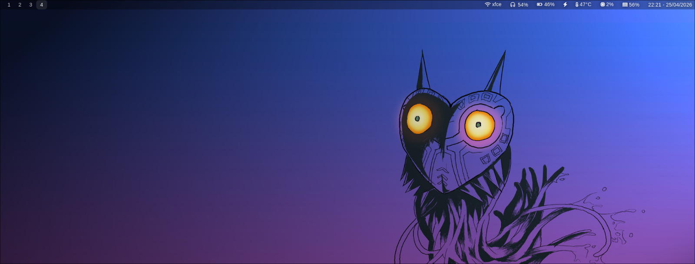
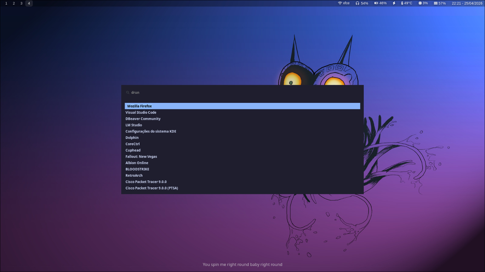
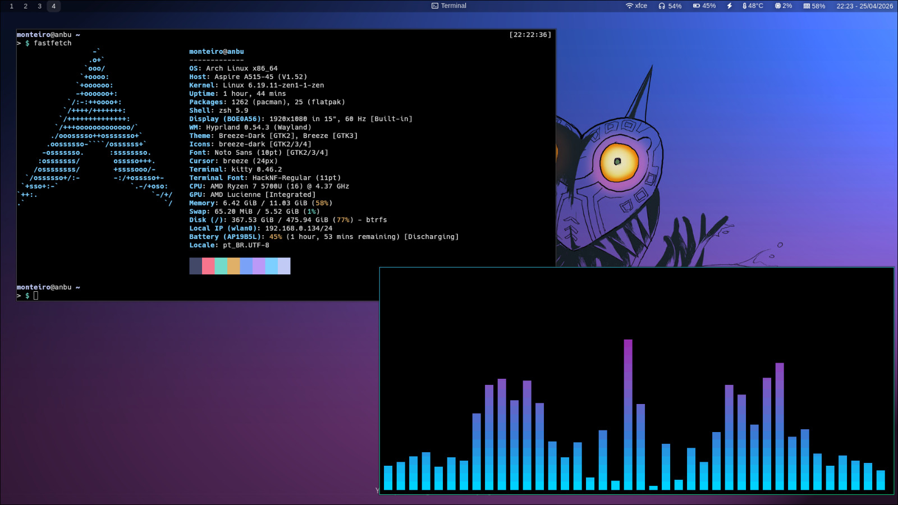
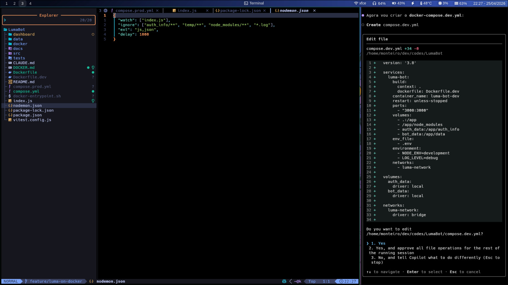

# Meu Setup — ~/.config

Este repositório mostra o visual e as configurações do meu ambiente (sem expor segredos). É pensado como um portfólio do meu desktop: compositor, barras, menus e tema do editor.

—

## Componentes mostrados
- Hyprland (compositor)
- Waybar (status bar)
- Wofi (launcher)
- nvim (config visual e tema)
- Kitty (terminal)
- Fastfetch (informações do sistema)

—

## Galeria

—

## Notas rápidas
- Arquivos de configuração portáveis estão no repositório; não incluí dados privados ou tokens.
- Se quiser reproduzir o setup, bastam as configurações: tema, módulos e atalhos (os binários e dados pessoais não estão aqui).